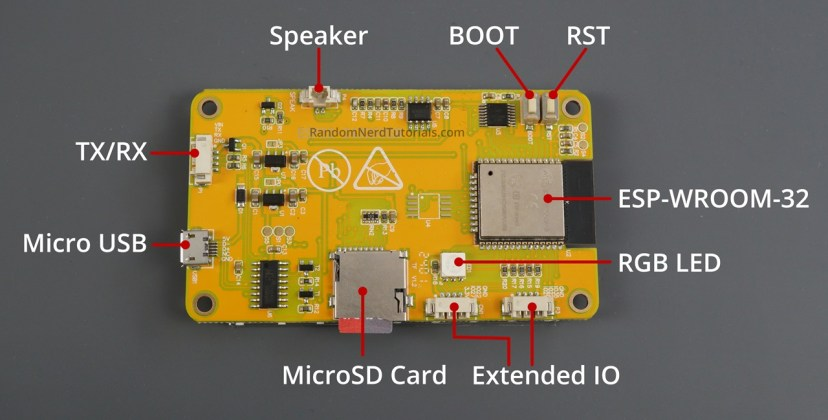

# ADS-B Radar — CYD Edition

A real-time aircraft radar display for the **ESP32-2432S028** (aka "Cheap Yellow Display" / CYD). Tracks aircraft using the ADS-B Exchange API and displays them on a 320x240 TFT screen with touch interaction.

No PSRAM required. No LVGL. Just direct TFT_eSPI rendering on a $15 board.

## Features

- **Radar view** — sweeping radar with aircraft blips, trails, heading lines, and sweep-based fading
- **Arrivals board** — tabular list with callsign, route, altitude, speed, distance
- **Stats dashboard** — uptime, WiFi, fetch stats, closest/highest/fastest aircraft
- **Flight log** — circular buffer of 50 recently seen aircraft
- **Detail view** — full aircraft info (type, operator, route, squawk, IAS/TAS/Mach)
- **Settings screen** — configure auto-cycle, alerts, trails via touch (persisted to NVS)
- **Compass rose** — N/S/E/W labels on radar
- **Auto-cycle** — automatically rotates views, pauses on touch
- **Brightness control** — PWM backlight, adjustable from stats view
- **Night mode** — amber/red palette, long-press to toggle
- **Filters** — cycle through ALL/COM/MIL/EMG/HELI/FAST/SLOW/ODD
- **Sort modes** — arrivals sortable by distance, altitude, or speed
- **Mil/Emergency alerts** — flashing border + banner on military/emergency aircraft
- **Closest approach record** — tracks the nearest aircraft ever seen

## Hardware

- **ESP32-2432S028** (ESP32-WROOM-32 with 2.8" ILI9341 320x240 TFT + XPT2046 touch)
- Available on AliExpress/Amazon for ~$15
- No additional wiring needed — everything is on-board

### Board layout



Key components (viewing the back of the board):
- **Micro USB** (left side) — for power, programming, and serial monitor
- **BOOT button** — near the center of the board, next to the speaker
- **RST button** — top-right corner
- **ESP-WROOM-32** — the metal-shielded module on the right

## Setup

### 1. Install PlatformIO

Install [VS Code](https://code.visualstudio.com/) and the [PlatformIO extension](https://platformio.org/install/ide?install=vscode), or install the CLI:

```bash
pip install platformio
```

### 2. Install USB drivers

Your CYD has a **CH340** USB-to-serial chip for programming. Some board variants also include a **CP2102** chip, but the CH340 is the one used for flashing.

- **CH340** — [download from manufacturer](http://www.wch-ic.com/downloads/CH341SER_ZIP.html) (Windows/Mac/Linux)
- **CP2102** (if your board has one) — [download from Silicon Labs](https://www.silabs.com/developers/usb-to-uart-bridge-vcp-drivers)

Most Linux distros include both drivers already. On Windows/Mac, install the driver **before** plugging in the board.

**Linux only:** Add yourself to the `dialout` group so you can access the serial port:

```bash
sudo usermod -aG dialout $USER
```

Then **log out and back in** (or reboot) for this to take effect.

### 3. Clone this repo

```bash
git clone https://github.com/jtucker0591/ADSB.git
cd ADSB
```

(See "Secrets & multi-board setup" below if this is a fresh checkout.)

### 4. Configure your WiFi and location

Real credentials and coordinates live in `src/secrets.h`, which is gitignored and never committed — see the section below before your first build.

You can find your coordinates at [latlong.net](https://www.latlong.net/).

### 5. Connect the CYD

Plug in the CYD via the **Micro USB** port (left side of the board, when viewing from the back). **Use a data cable, not a charge-only cable** — if the board isn't detected, the cable is the most likely cause.

Verify the board is detected:

- **Linux:** `ls /dev/ttyUSB*` — you should see `/dev/ttyUSB0`
- **Mac:** `ls /dev/cu.usbserial*` or `ls /dev/cu.wchusbserial*`
- **Windows:** Open Device Manager → Ports — look for "USB-SERIAL CH340" or "CP210x"

### 6. Know your buttons

Refer to the [board layout photo](#board-layout) above. The two buttons on the back are:

- **BOOT** — closer to the center of the board (near the speaker)
- **RST** (Reset) — in the top-right corner

You may need these during flashing (see step 7).

### 7. Build and flash

```bash
pio run -e cyd -t upload
```

If the upload fails with a connection error, try holding the **BOOT** button:

1. Hold **BOOT**
2. While holding BOOT, press and release **RST**
3. Release **BOOT**
4. Run the upload command within a few seconds

If the upload fails because it can't find the port, specify it explicitly:

```bash
# Linux
pio run -e cyd -t upload --upload-port /dev/ttyUSB0

# Mac
pio run -e cyd -t upload --upload-port /dev/cu.usbserial-XYZ

# Windows
pio run -e cyd -t upload --upload-port COM3
```

### 8. Verify it works

After flashing, the CYD will reboot and show a startup screen. It will:

1. Connect to your WiFi (the screen shows connection status)
2. Start fetching aircraft data
3. Display the radar view with any aircraft in range

If the screen stays white or blank, double-check your WiFi credentials in `src/config.h` and re-flash.

### 9. Monitor serial output (optional)

To see debug output and connection info:

```bash
pio device monitor
```

## Troubleshooting

| Problem | Solution |
|---------|----------|
| Board not detected (no `/dev/ttyUSB*` or COM port) | Try a different USB cable — charge-only cables won't work. Install the CH340 or CP2102 driver (see step 2). |
| "Permission denied" on Linux | Run `sudo usermod -aG dialout $USER`, then log out and back in. |
| Upload fails with "connection timeout" or "invalid head of packet" | Put the board in download mode: hold **BOOT**, press and release **RST**, release **BOOT**, then upload within a few seconds. |
| Upload still fails after BOOT/RST | Try a lower baud rate: add `upload_speed = 115200` to `platformio.ini`. Also try a different USB cable. |
| "Invalid head of packet" every time | Some CYD boards have two serial chips (CH340 + CP2102). The CH340 is the programming port. If you see two `/dev/ttyUSB*` devices, try the other one. On Linux, run `lsusb` to identify which is which. |
| Screen is white/blank after flash | Check WiFi credentials in `src/config.h`. Open serial monitor (`pio device monitor`) to see error messages. |
| No aircraft showing | Verify your coordinates are correct. Make sure you're within range of aircraft (75nm default). The free API may have brief outages — wait a minute and check again. |

## Touch Controls

The screen is divided into three vertical zones: **left 45%**, **center 10%**, **right 45%**. The narrow center zone prevents accidental view changes. Tap for a short press, or hold for 1 second for a long press.

| View | Left tap | Center tap | Center HOLD (1s) | Right tap |
|------|----------|------------|------------------|-----------|
| **Radar** | Cycle filter (ALL → COM → MIL → EMG → HELI → FAST → SLOW → ODD) | Next view | Cycle location (if 2+ configured) | Cycle range (150 → 100 → 50 → 20 → 5nm) |
| **Arrivals** | Cycle sort (DST → ALT → SPD) | Tap aircraft row → Detail view | — | Cycle range |
| **Stats** | Brightness down (-12%) | Next view | Toggle night mode (green/amber) | Brightness up (+12%) |
| **Log** | Previous page | Next view | — | Next page |
| **Settings** | Previous setting | Next view | Toggle/change selected setting | Next setting |
| **Detail** | Previous aircraft | Back to Radar | — | Next aircraft |

**View cycle:** Radar → Arrivals → Stats → Log → Settings → Radar

**Detail view** is not part of the normal cycle — tap an aircraft row in the Arrivals list to open it.

**Location cycling:** long-press the center of the screen in Radar view to switch to the next configured location preset (LOC1 → LOC2 → LOC3 → LOC1 …). The radar clears and starts fresh at the new site — see "Location presets" below for how presets are configured and why the switch survives OTA updates.

## Settings Screen

Navigate to the settings screen by tapping through views (Radar → Arrivals → Stats → Log → **Settings**).

- Tap **left/right** to highlight a setting
- **Long-press middle** (hold for 1 second) to toggle or cycle the value
- Changes save to flash immediately and persist across reboots

Available settings:
| Setting | Values |
|---------|--------|
| Auto Cycle | ON / OFF |
| Cycle Interval | 15s / 30s / 60s / 90s |
| Inactivity Pause | 30s / 60s / 120s |
| Alert Military | ON / OFF |
| Alert Emergency | ON / OFF |
| Trails | ON / OFF |
| Trail Style | LINE / DOTS |

## Secrets & multi-board setup

This repo is public, but WiFi passwords and home coordinates obviously shouldn't be. Those live in `src/secrets.h`, which is listed in `.gitignore` and never committed.

`ADSB_RADIUS_NM` (the API query radius) lives in `secrets.h` too, even though it's not sensitive — it's board-specific for a different reason: this device has no PSRAM, so near busy airspace (a major airport, a big city) a wide radius can pull back more aircraft data than it can reliably parse in memory. That fails as a `JSON error: NoMemory` in Serial, and looks like the splash screen just never advancing (it's waiting on a first successful fetch that never comes). If you see that, lower `ADSB_RADIUS_NM` for that board. Rural spots can usually run the full 50nm; anything near a Class B/C airport should probably start around 15-20nm.

**First build on a new machine:**

```bash
cp src/secrets.example.h src/secrets.h
```

Then edit `src/secrets.h` with your real WiFi credentials, home coordinates, and (optionally) up to two more location presets you can cycle to on-device. If `secrets.h` is missing, the build still succeeds using placeholder values (empty WiFi, `0,0` location) — it just won't actually work as a tracker until you fill it in.

**Running more than one board:** each physical board needs its own `secrets.h` at the time you first flash it over USB, since that's what sets its WiFi and home location. After that first boot, the board saves its own identity into its own flash (NVS) automatically — it's no longer tied to whatever's compiled into `secrets.h`, and won't be affected by future shared OTA updates (see below). You only touch `secrets.h` again when building for a brand-new board.

**Location presets (LOC1-3):** the same rule applies to `LOC1_NAME`/`LOC2_NAME`/`LOC3_NAME` and their coordinates — the full set is seeded into NVS the first time a board boots firmware built with its own real `secrets.h`, exactly like WiFi/home location. That's what makes on-device location cycling (long-press center in Radar view — see "Touch Controls" above) safe across OTA updates: without this, a shared/OTA build (always compiled with placeholder secrets — see "OTA Updates" below) would collapse every board's presets down to one blank entry the moment it took its first automatic update. Once seeded, changing a board's presets again means either editing them on-device (no settings-screen UI for that yet) or erasing NVS and reflashing over USB with an updated `secrets.h`.

The `config_*.h` files you'll see in `src/` (`config_Hillsborough.h`, `config_New_Bern.h`, `config_W03.h`) are historical records from before this setup existed — each one was previously copied over `config.h` to build that specific board. They're no longer part of the active build and their real values have been redacted.

## OTA Updates

Boards check for new firmware automatically once a day (`OTA_CHECK_INTERVAL_MS` in `config.h`) by reading this repo's latest GitHub Release, and install it if the release tag differs from the running `VERSION`. No manifest file to maintain — just GitHub's built-in "latest release" API.

**Before this works**, set your real GitHub username/repo in `src/config.h`:

```c
#define OTA_GITHUB_OWNER "jtucker0591"
#define OTA_GITHUB_REPO  "ADSB"
```

**Publishing an update:**

1. Bump `VERSION` in `src/config.h` (e.g. `"v2.1"`).
2. Build: `pio run -e cyd`
3. The compiled binary is at `.pio/build/cyd/firmware.bin`.
4. Create a GitHub Release tagged to match `VERSION` exactly (e.g. tag `v2.1`), and attach `firmware.bin` as a release asset.
5. Every board picks it up within a day (or immediately, if you check in on one over serial and see it happen sooner).

**Important:** build the release binary using a generic/placeholder `secrets.h` (or none at all), not your personal one — this is the one binary that goes out to every board, and each board keeps its own WiFi/location in its own flash regardless of what's compiled into the release. Don't build a release from a `secrets.h` with one specific board's real credentials in it.

**Safety net:** if a newly-installed build can't get through startup a few times in a row, the board automatically reverts to the previous firmware and pauses auto-updates until it's stable again — you don't have to be there for it to fail safely. That said, this hasn't been exercised on real hardware yet — test it deliberately (e.g. push one intentionally-broken build to a board you can physically reach) before trusting it on a board you can't.

## Data Sources

- **Aircraft positions:** [api.adsb.lol](https://api.adsb.lol) (free, no API key)
- **Enrichment data:** [adsbdb.com](https://www.adsbdb.com) (callsign/aircraft lookups)

## Flash Usage

```
RAM:   19.8% (64KB / 320KB)
Flash: 88.0% (1.15MB / 1.31MB) — ~157KB free
```

## License

MIT
